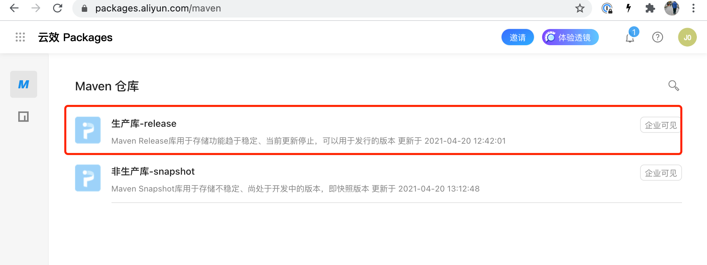
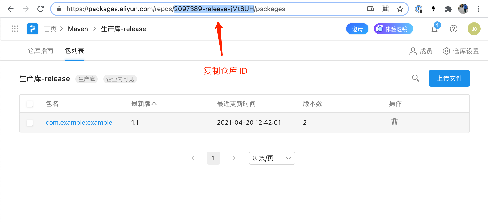
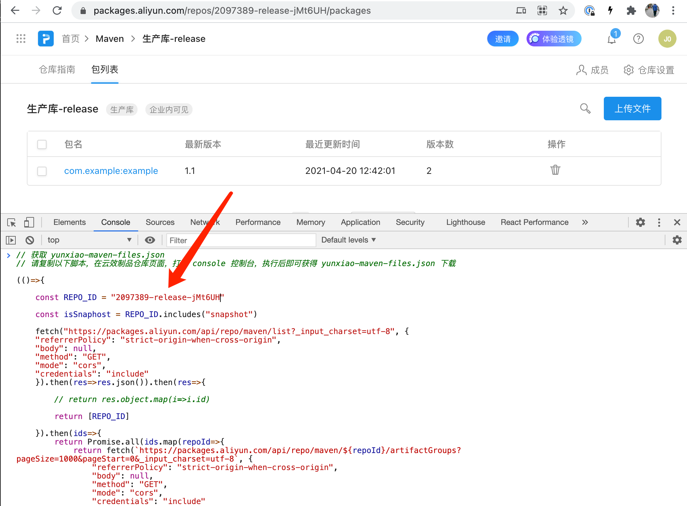
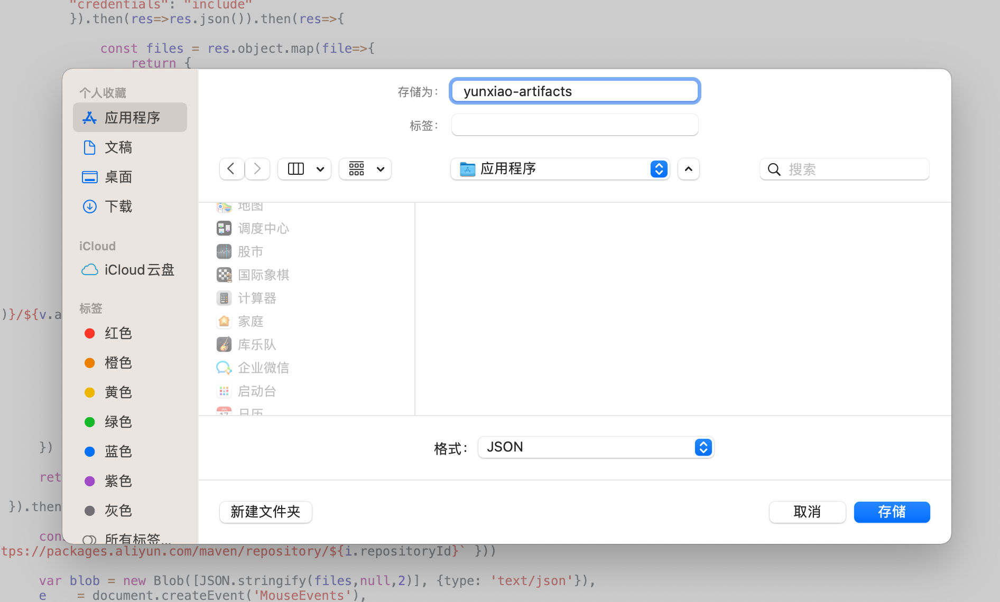
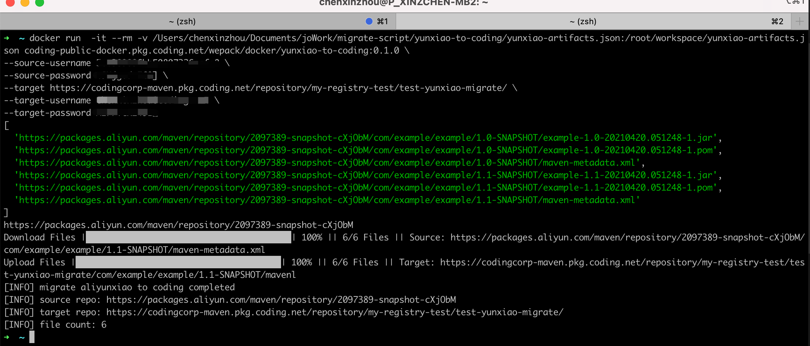

## Yunxiao to CODING 


## 迁移流程

1. 从云效控制台生成 yunxiao-artifacts.json
2. 使用 yunxiao-to-coding 迁移制品


## 从云效控制台生成 yunxiao-artifacts.json

> 由于云效制品仓库没有 OPEN-API ，所以需要从控制台获取迁移的数据

1. 选中期望迁移的云效仓库




2. 复制目标仓库 ID 





3. 打开浏览器控制台，复制粘贴脚本到浏览器，替换脚本中的 REPO_ID 值，回车执行


```javascript
// 获取 yunxiao-maven-files.json
// 请复制以下脚本，在云效制品仓库页面，打开 console 控制台，粘贴回车执行后即可获得 yunxiao-maven-files.json 下载

(()=>{

    const REPO_ID = "请将此处换成云效仓库的 ID"

    const isSnaphost = REPO_ID.includes("snapshot")

    fetch("https://packages.aliyun.com/api/repo/maven/list?_input_charset=utf-8", {
    "referrerPolicy": "strict-origin-when-cross-origin",
    "body": null,
    "method": "GET",
    "mode": "cors",
    "credentials": "include"
    }).then(res=>res.json()).then(res=>{

        // return res.object.map(i=>i.id)

        return [REPO_ID]
        
    }).then(ids=>{
        return Promise.all(ids.map(repoId=>{
            return fetch(`https://packages.aliyun.com/api/repo/maven/${repoId}/artifactGroups?pageSize=1000&pageStart=0&_input_charset=utf-8`, {
                "referrerPolicy": "strict-origin-when-cross-origin",
                "body": null,
                "method": "GET",
                "mode": "cors",
                "credentials": "include"
            }).then(res=>res.json()).then(res=> res.object.dataList.reduce((total, item) => {

                return [...total, ...item.versions.map(v=>{
                    return {
                        artifactId: item.artifactId,
                        groupId: item.groupId,
                        repositoryId: item.repositoryId,
                        version: v,
                    }
                })]
            

            },[]))
        }))
    }).then(repoArtifactGroup=>{

        const versions = repoArtifactGroup.reduce((total, item)=>{  return [...total,...item] },[])

        const pms = versions.map(v=>{
            return fetch(`https://packages.aliyun.com/api/repo/maven/${v.repositoryId}/artifactGroup/details?groupId=${v.groupId}&artifactId=${v.artifactId}&version=${v.version}&_input_charset=utf-8`, {
            "referrerPolicy": "strict-origin-when-cross-origin",
            "body": null,
            "method": "GET",
            "mode": "cors",
            "credentials": "include"
            }).then(res=>res.json()).then(res=>{
                
                const files = res.object.map(file=>{
                    return {
                        ...v,
                        fileName: file.fileName,
                        downloadUrl : file.url,
                    }
                })

                if (isSnaphost && res.object.length>0 ){

                    // const downloadUrl = 

                    return [
                        ...files,
                        {
                            ...v,
                            fileName: "maven-metadata.xml",
                            downloadUrl: `https://placeholder/repository/${v.repositoryId}/${v.groupId.replace(/\./g , "/")}/${v.artifactId}/${v.version}/maven-metadata.xml`
                        }
                    ]
                }

                return files

            
            });
        })

        return Promise.all(pms)

    }).then(res=>{

        const files = res.reduce((total, item)=>{  return [...total,...item] },[]).map(i=>({...i, repoPath: `https://packages.aliyun.com/maven/repository/${i.repositoryId}` }))

        var blob = new Blob([JSON.stringify(files,null,2)], {type: 'text/json'}),
        e    = document.createEvent('MouseEvents'),
        a    = document.createElement('a')

        a.download = "yunxiao-artifacts.json"
        a.href = window.URL.createObjectURL(blob)
        a.dataset.downloadurl =  ['text/json', a.download, a.href].join(':')
        e.initMouseEvent('click', true, false, window, 0, 0, 0, 0, 0, false, false, false, false, 0, null)
        a.dispatchEvent(e)
    });


})()

```




4. 等待脚本执行结束，获取 yunxiao-artifacts.json (请注意：如果制品比较多，脚本执行可能需要一定的时间)




## 使用 yunxiao-to-coding 迁移制品

> 注意：本地需要安装 docker

```
docker run  -it --rm -v <yunxiao-artifacts.json 文件的绝对路径>:/root/workspace/yunxiao-artifacts.json coding-public-docker.pkg.coding.net/wepack/docker/yunxiao-to-coding:0.1.0 \
--source-username <云效 访问账号> \
--source-password <云效 访问密码> \
--target <CODING 制品仓库地址，如 https://myteam-maven.pkg.coding.net/repository/my-project/my-repo/> \
--target-username <CODING 制品仓库访问账号> \
--target-password <CODING 制品仓库访问密码> \
```



看到上述内容即为迁移成功


## TODO

- NPM
- Docker
- PyPI